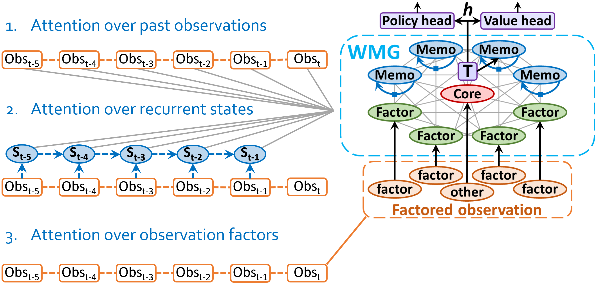

# Working Memory Graphs
This repository accompanies 
the ICML 2020 paper [Working Memory Graphs](https://proceedings.icml.cc/static/paper_files/icml/2020/1696-Paper.pdf)
by Ricky Loynd, Roland Fernandez, Asli Celikyilmaz, Adith Swaminathan and Matthew Hausknecht.
([Video](https://icml.cc/virtual/2020/poster/6038))

WMG is a Transformer-based RL agent that attends to
a dynamic set of vectors representing observed and recurrent state.

# Installation
(The code has been tested with Python 3.6, on Windows and Linux.)
* Create a new virtual environment.
* Activate the virtual environment.
* Install PyTorch 1.3.1.
* Install BabyAI (from any directory):
	* conda install -c conda-forge python-blosc
	* git clone -b iclr19 https://github.com/mila-iqia/babyai.git
	* cd babyai
	* pip install --user --editable .
	* cd ..
* Clone the wmg_agent repository.
* cd wmg_agent
* pip install -r requirements.txt

# Running experiments

Execute all run commands from the **wmg_agent** directory, using this format:

    python run.py <runspec>

Execute the runspecs in the [specs](specs) directory to reproduce results from the paper.
They can also be used as examples for new experiments.

# Citations

If using this code in your work, please cite as follows:

    @incollection{icml2020_1696,
      author = {Loynd, Ricky and Fernandez, Roland and Celikyilmaz, Asli and Swaminathan, Adith and Hausknecht, Matthew},
      booktitle = {Proceedings of Machine Learning and Systems 2020},
      pages = {2928--2937},
      title = {Working Memory Graphs},
      year = {2020}
    }

This repo's implementation of Sokoban was derived in part from that of 
[https://github.com/mpSchrader/gym-sokoban](https://github.com/mpSchrader/gym-sokoban).
If using the Sokoban environment in your work, please honor that source's 
[license](environments/gym-sokoban-LICENSE), and cite as follows:

    @misc{SchraderSokoban2018,
      author = {Schrader, Max-Philipp B.},
      title = {gym-sokoban},
      year = {2018},
      publisher = {GitHub},
      journal = {GitHub repository},
      howpublished = {\url{https://github.com/mpSchrader/gym-sokoban}},
      commit = {#CommitId}
    }

For convenience, we provide some of the predefined Boxoban levels from [https://github.com/deepmind/boxoban-levels](https://github.com/deepmind/boxoban-levels).
If using this data in your work, please honor that source's 
[license](data/boxoban-levels-master/LICENSE), and cite as follows:

    @misc{boxobanlevels,
      author = {Arthur Guez, Mehdi Mirza, Karol Gregor, Rishabh Kabra, Sebastien Racaniere, Theophane Weber, David Raposo, Adam Santoro, Laurent Orseau, Tom Eccles, Greg Wayne, David Silver, Timothy Lillicrap, Victor Valdes},
      title = {An investigation of Model-free planning: boxoban levels},
      howpublished= {https://github.com/deepmind/boxoban-levels/},
      year = "2018",
    }

# Contributing

This project welcomes contributions and suggestions.  Most contributions require you to agree to a
Contributor License Agreement (CLA) declaring that you have the right to, and actually do, grant us
the rights to use your contribution. For details, visit https://cla.opensource.microsoft.com.

When you submit a pull request, a CLA bot will automatically determine whether you need to provide
a CLA and decorate the PR appropriately (e.g., status check, comment). Simply follow the instructions
provided by the bot. You will only need to do this once across all repos using our CLA.

This project has adopted the [Microsoft Open Source Code of Conduct](https://opensource.microsoft.com/codeofconduct/).
For more information see the [Code of Conduct FAQ](https://opensource.microsoft.com/codeofconduct/faq/) or
contact [opencode@microsoft.com](mailto:opencode@microsoft.com) with any additional questions or comments.
