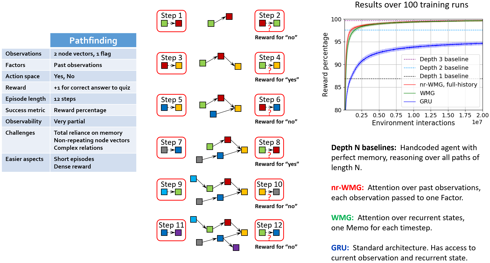
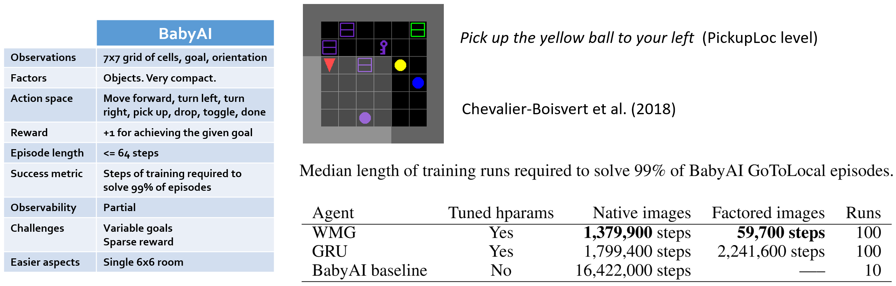
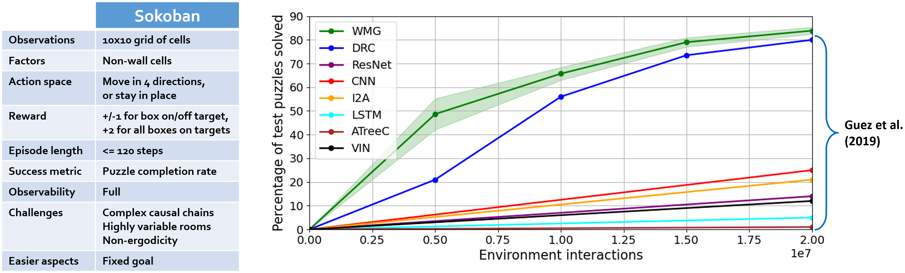
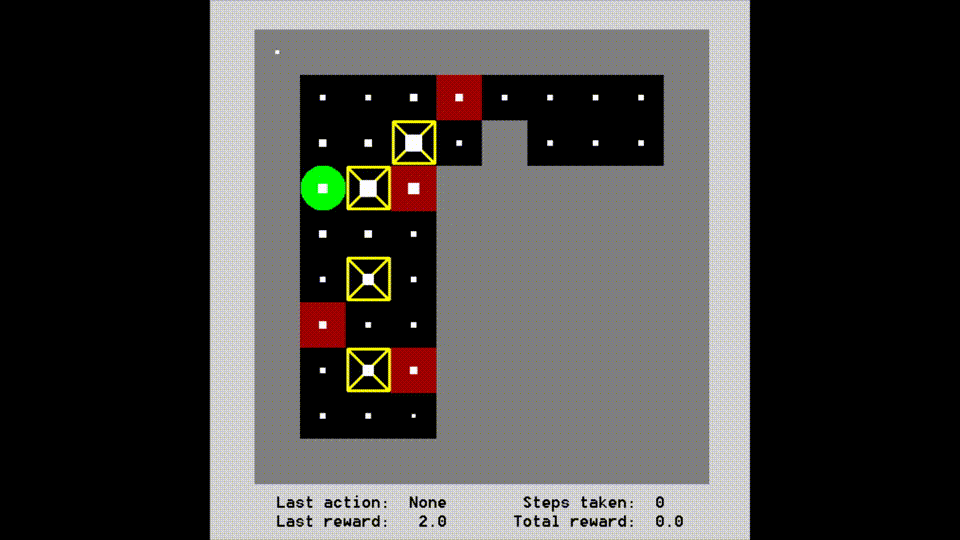

# Runspecs

Each runspec file defines all the settings for a single run.
To execute a runspec, with **wmg_agent** as the current directory, type:

    python run.py specs/<runspec>

For each runspec below, hyperparameters were tuned for the particular combination of agent and environment.

# Pathfinding

### WMG agent

[train_wmg_on_pathfinding.py](train_wmg_on_pathfinding.py) 
trains a new WMG agent on random Pathfinding episodes.

[test_wmg_on_pathfinding.py](test_wmg_on_pathfinding.py)
loads **models/wmg_pathfinding.pth** (one of the 100 WMG agent models trained on 20M environment interactions),
then tests the agent on 1000 random episodes.
The reward per step should be around 0.498, which is 99.6% of possible reward.

### Non-recurrent WMG agent given full history

[train_nr_wmg_on_pathfinding.py](train_nr_wmg_on_pathfinding.py)
trains a new nr-WMG agent on random Pathfinding episodes.

[test_nr_wmg_on_pathfinding.py](test_nr_wmg_on_pathfinding.py)
loads **models/nr_wmg_pathfinding.pth** (one of the 100 nr-WMG agent models trained on 20M environment interactions),
then tests the agent on 1000 random episodes.
The reward per step should be around 0.498, which is 99.6% of possible reward.

### GRU agent

[train_gru_on_pathfinding.py](train_gru_on_pathfinding.py)
trains a new GRU agent on random Pathfinding episodes.

[test_gru_on_pathfinding.py](test_gru_on_pathfinding.py)
loads **models/gru_pathfinding.pth** (one of the 100 GRU agent models trained on 20M environment interactions),
then tests the agent on 1000 random episodes.
The reward per step should be around 0.474, which is 94.7% of possible reward.

# BabyAI

The following BabyAI runspecs use Level 4 (GoToLocal).
Any of the other 18 BabyAI levels can be selected by modifying the runspec.

### WMG agent

[train_wmg_on_factored_babyai.py](train_wmg_on_factored_babyai.py)
trains a new WMG agent on random BabyAI episodes with factored images,
until it reaches a success rate of 99% on 10,000 random episodes.

[test_wmg_on_factored_babyai.py](test_wmg_on_factored_babyai.py)
loads **models/wmg_factored_babyai.pth**,
a WMG agent model trained for 52,000 environment interactions,
then tests the agent on 1,000 random episodes.
The success rate should be about 99%.

[train_wmg_on_flat_babyai.py](train_wmg_on_flat_babyai.py)
trains a new WMG agent on random BabyAI episodes with flattened native images,
until it reaches a success rate of 99% on 10,000 random episodes.

[test_wmg_on_flat_babyai.py](test_wmg_on_flat_babyai.py)
loads **models/wmg_flat_babyai.pth**,
a WMG agent model trained for 1,330,000 environment interactions,
then tests the agent on 1,000 random episodes.
The success rate should be about 99%.

### GRU agent

[train_gru_on_factored_babyai.py](train_gru_on_factored_babyai.py)
trains a new GRU agent on random BabyAI episodes with factored images,
until it reaches a success rate of 99% on 10,000 random episodes.

[test_gru_on_factored_babyai.py](test_gru_on_factored_babyai.py)
loads **models/gru_factored_babyai.pth**
(a GRU agent model trained for 2,370,000 environment interactions),
then tests the agent on 1,000 heldout episodes.
The success rate should be about 99%.

[train_gru_on_flat_babyai.py](train_gru_on_flat_babyai.py)
trains a new GRU agent on random BabyAI episodes with flattened native images,
until it reaches a success rate of 99% on 10,000 random episodes.

[test_gru_on_flat_babyai.py](test_gru_on_flat_babyai.py)
loads **models/gru_flat_babyai.pth**
(a GRU agent model trained for 1,970,000 environment interactions),
then tests the agent on 1,000 heldout episodes.
The success rate should be about 99%.

# Sokoban

(More WMG-Sokoban videos available [here](https://tinyurl.com/vdz6gdd). Many thanks to Felipe Frujeri for creating these.)

[train_wmg_on_sokoban.py](train_wmg_on_sokoban.py)
trains a new WMG agent on Sokoban puzzles drawn randomly 
from the [train set](../data/boxoban-levels-master/unfiltered/train), which contains 10k puzzles.
In order to train an agent on the full train set of 900k puzzles, 
first copy all 900 files from [https://github.com/deepmind/boxoban-levels](https://github.com/deepmind/boxoban-levels) 
into the [train set directory](../data/boxoban-levels-master/unfiltered/train).

[test_wmg_on_sokoban.py](test_wmg_on_sokoban.py)
loads **models/wmg_sokoban.pth** (one of the 20 WMG agent models trained on 20M environment interactions),
then tests the agent on the official [test set](../data/boxoban-levels-master/unfiltered/test) of 1000 puzzles.
The success rate should be around 84%.

[render_wmg_on_sokoban.py](render_wmg_on_sokoban.py)
loads **models/wmg_sokoban.pth** and displays a series of Sokoban puzzles 
drawn randomly from the [train set](../data/boxoban-levels-master/unfiltered/train).
To interact with the display: 
* Use the arrow keys to choose the agent's move.
* Press **space** to let the agent choose the next move.
* Press **N** to skip to the next puzzle.
* Press **Esc** to exit.
